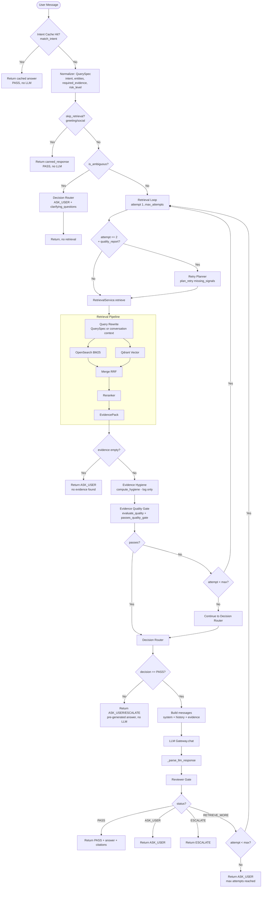
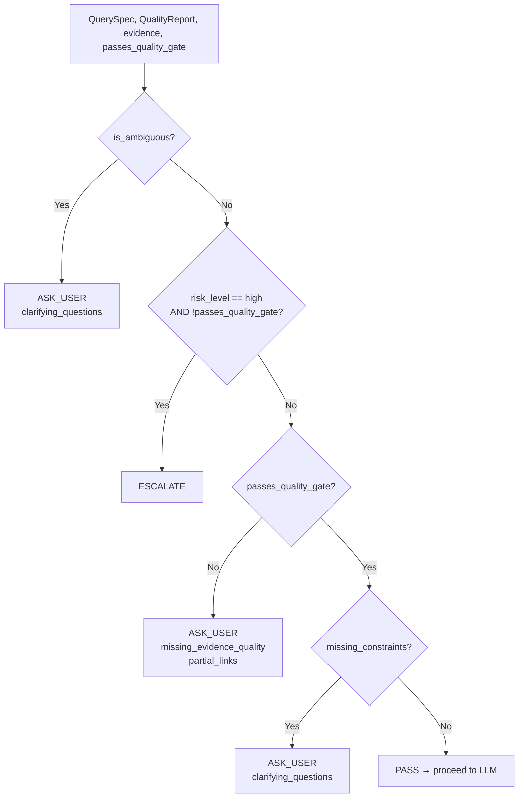
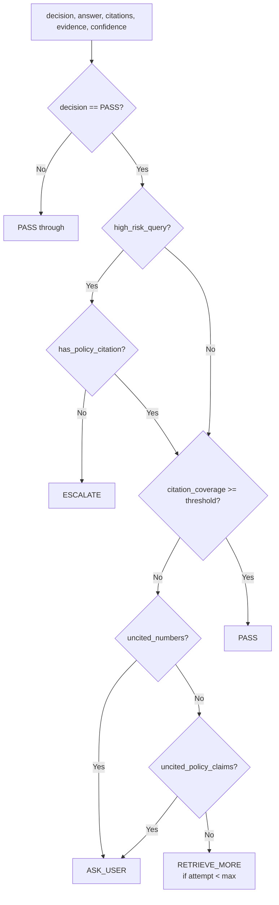
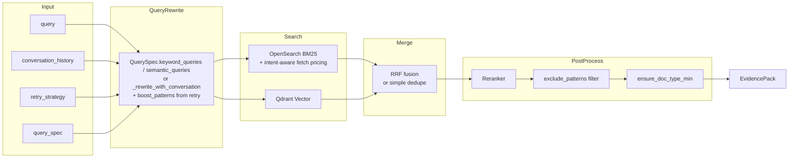

# Current Logic Flow – Auto-Reply Chatbot

Document describing the processing flow from receiving a question to returning an answer.

---

## 1. Main Flow Overview

```
┌─────────────────────────────────────────────────────────────────────────────────────────┐
│                           API: POST /conversations/{id}/messages                         │
│                                    (body: { content })                                    │
└─────────────────────────────────────────────────────────────────────────────────────────┘
                                              │
                                              ▼
┌─────────────────────────────────────────────────────────────────────────────────────────┐
│  Guardrails: check_injection() → sanitize_user_input()                                   │
└─────────────────────────────────────────────────────────────────────────────────────────┘
                                              │
                                              ▼
┌─────────────────────────────────────────────────────────────────────────────────────────┐
│                         AnswerService.generate(query, conversation_history)              │
└─────────────────────────────────────────────────────────────────────────────────────────┘
```

---

## 2. Detailed Flow in AnswerService.generate()



---

## 3. Main Modules and Order

| Phase | Module | Description |
|-------|--------|-------------|
| 0 | Intent Cache | `match_intent()` – cache common questions (who am i, what can you do) |
| 0.5 | Evidence Hygiene | `compute_hygiene()` – log metrics, no gating |
| 1 | Normalizer | `normalize()` → **QuerySpec** (intent, entities, required_evidence, risk_level, is_ambiguous) |
| 2 | Retrieval | `RetrievalService.retrieve()` – BM25 + Vector + RRF + Rerank |
| 2b | Retry Planner | `plan_retry(missing_signals, 2)` – Attempt 2: boost_patterns, filter_doc_types |
| 3 | Evidence Quality Gate | `evaluate_quality()` + `passes_quality_gate()` – check required_evidence |
| 4 | Decision Router | `route()` – PASS / ASK_USER / ESCALATE (before LLM) |
| 5 | LLM | `LLMGateway.chat()` – generate answer |
| 6 | Reviewer Gate | `review()` – check citations, policy, confidence |

---

## 4. Decision Router – Logic



---

## 5. Retry Planner – Logic (Attempt 2)

| missing_signal | boost_patterns | filter_doc_types | exclude_patterns |
|----------------|---------------|------------------|------------------|
| missing_numbers | $, USD, /mo, /month, pricing, \d+ | - | - |
| missing_links | https://, order, store | - | - |
| missing_transaction_link | order, checkout, store | - | - |
| missing_policy | policy, terms, refund | policy, tos | - |
| missing_steps | step, 1., 2., first | - | - |
| boilerplate_risk | - | - | menu, footer, copyright |
| staleness_risk | - | - | - |

---

## 6. Reviewer Gate – Logic



---

## 7. Retrieval Pipeline – Details



---

## 8. Main Data Structures

### QuerySpec (Normalizer output)
```yaml
intent: string
entities: list
constraints: dict
required_evidence: list  # numbers, links, transaction_link, policy, steps
risk_level: low | medium | high
keyword_queries: list
semantic_queries: list
clarifying_questions: list
is_ambiguous: bool
skip_retrieval: bool
canned_response: string | null
```

### DecisionResult (Decision Router output)
```yaml
decision: PASS | ASK_USER | ESCALATE
reason: string
clarifying_questions: list
partial_links: list
answer: string  # pre-generated when ASK_USER/ESCALATE
```

### AnswerOutput (AnswerService output)
```yaml
decision: PASS | ASK_USER | ESCALATE
answer: string
followup_questions: list
citations: list
confidence: float
debug: dict
```

---

## 9. Exit Points (no LLM call)

1. **Intent cache hit** → return immediately
2. **skip_retrieval** (greeting) → return canned_response
3. **is_ambiguous** → Decision Router → ASK_USER
4. **empty evidence** → ASK_USER
5. **Decision Router ≠ PASS** → ASK_USER or ESCALATE
6. **LLM error** → ESCALATE

---

## 10. Exit Points (with LLM call)

1. **Reviewer PASS** → return answer + citations
2. **Reviewer ASK_USER** → return
3. **Reviewer ESCALATE** → return
4. **Reviewer RETRIEVE_MORE** + attempt < max → retry loop
5. **Max attempts reached** → return ASK_USER

---

*Document generated from current codebase.*  
*References: `app/services/answer_service.py`, `app/archi.md`*
